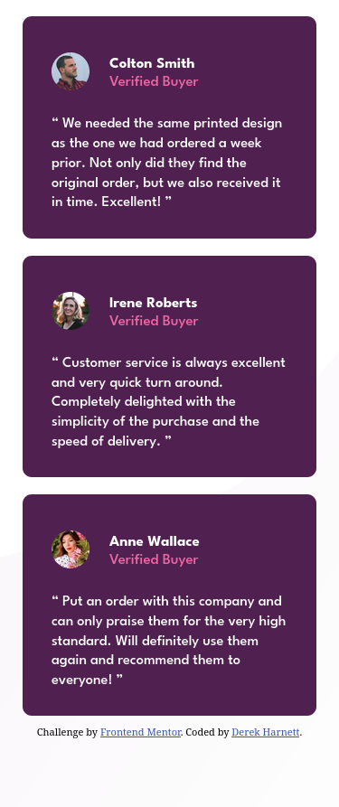

# Frontend Mentor - Social proof section solution

This is a solution to the [Social proof section challenge on Frontend Mentor](https://www.frontendmentor.io/challenges/social-proof-section-6e0qTv_bA). Frontend Mentor challenges help you improve your coding skills by building realistic projects. 

## Table of contents

- [Overview](#overview)
  - [The challenge](#the-challenge)
  - [Screenshots](#screenshots)
  - [Links](#links)
- [My process](#my-process)
  - [Built with](#built-with)
  - [What I learned](#what-i-learned)
  - [Continued development](#continued-development)
  - [Useful resources](#useful-resources)
- [Author](#author)
- [Acknowledgments](#acknowledgments)

## Overview

### The challenge

Users should be able to:

- View the optimal layout for the section depending on their device's screen size

### Screenshots

### Links

- Solution URL: [https://github.com/harnettd/social-proof-section](https://github.com/harnettd/social-proof-section)
- Live Site URL: [https://harnettd.github.io/social-proof-section/](https://harnettd.github.io/social-proof-section/)

## My process

### Built with

- HTML5
- CSS, including Flexbox and CSS Grid, with the SMACSS methodology

### What I learned

In completing this project, I learned

- to organize my CSS stylesheet using the SMACSS methodology in which CSS rules are categorized as base rules, layout rules, module rules, and state rules. (I didn't need theme rules.) For module rules and state rules, I stuck with the BEM naming convention. I found this methodology to be particularly convenient for small projects such as those classifieded as Newbie on Frontend Mentor.

### Continued development

As this was a small project, the number of base and layout rules used was minimal. It will be interesting and educational to use the SMACSS methodology on a larger project. 

### Useful resources

- [Scalable and Modular Architecture for CSS](https://smacss.com/) - By reading this online book, I learned how to use the SMACSS methodology to organize a CSS stylesheet.

## Author

- Github - [Derek Harnett](https://github.com/harnettd)
- Frontend Mentor - [@harnettd](https://www.frontendmentor.io/profile/harnettd)

## Acknowledgments

Thanks to [Frontend Mentor](https://www.frontendmentor.io) for posting this challenge.
